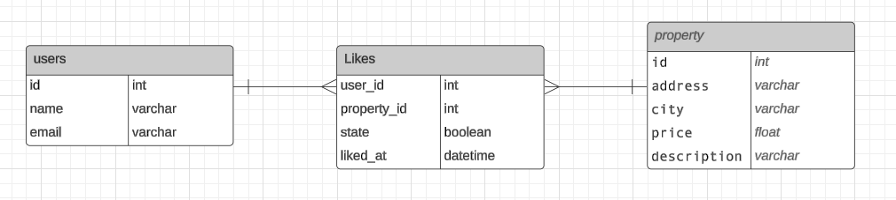

# Microservicio de Consulta de Inmuebles

Este proyecto tiene como objetivo desarrollar un microservicio que permita a los usuarios externos consultar los inmuebles disponibles en una base de datos.

## Tecnologías Utilizadas

- **Python:** Lenguaje de programación principal.
- **MySQL:** Sistema de gestión de bases de datos relacional.
- **HTTPServer:** Módulo de Python para implementar el servidor HTTP.
- **JSON:** Formato de intercambio de datos.

## Implementación

El microservicio se desarrollará utilizando Python y el módulo `http.server`. Se utilizará una base de datos MySQL para almacenar la información de los inmuebles.

## Consideraciones de Seguridad

Se implementarán medidas de seguridad para proteger el microservicio contra posibles ataques de inyección SQL y otros problemas de seguridad. Se utilizarán consultas preparadas y validación de datos para garantizar que las entradas de los usuarios sean seguras y no comprometan la integridad de la base de datos.

## Documentación

Se proporcionará documentación detallada de las clases y funciones en el código fuente para facilitar su comprensión y mantenimiento.

## Para Correr el servidor, descargamos el repositorio, creamos el entorno virtual, instalamos la dependencia para conectarnos a mysql con el siguiente comando: pip install mysql-connector-python

## Por ultimo ingresamos a la carpeta api y ejecutamos el archivo llamado server.py

# Microservicio de de “Me gusta”

Este documento describe el diseño de la base de datos para la implementación de la funcionalidad de "Me gusta". La funcionalidad de "Me gusta" permite a los usuarios expresar su interés en los inmuebles y nos permitirá rastrear esas interacciones en la base de datos.

## Entidades y Relaciones

- **Users:** Representa a los usuarios de la aplicación que pueden interactuar con los inmuebles.
- **Property:** Representa los inmuebles que pueden recibir "Me gusta" por parte de los usuarios.
- **Likes:** Una tabla de unión que registra las interacciones de "Me gusta" entre usuarios e inmuebles.

Usaremos una tabla de unión Likes para registrar las relaciones de "Me gusta" entre usuarios e inmuebles. Esto nos permitirá mantener un registro claro de las interacciones y facilitará la consulta y la generación de informes sobre las mismas.

## Atributos Adicionales

Además de las claves foráneas user_id y property_id, agregaremos los siguientes atributos adicionales a la tabla Likes:

- **liked_at:** Registra la fecha y hora en que se dio el "Me gusta".
- **active:** Indica si el "Me gusta" está activo o desactivado, lo que permitirá a los usuarios deshacer un "Me gusta" en el futuro.

# Diagrama Entidad Relación

